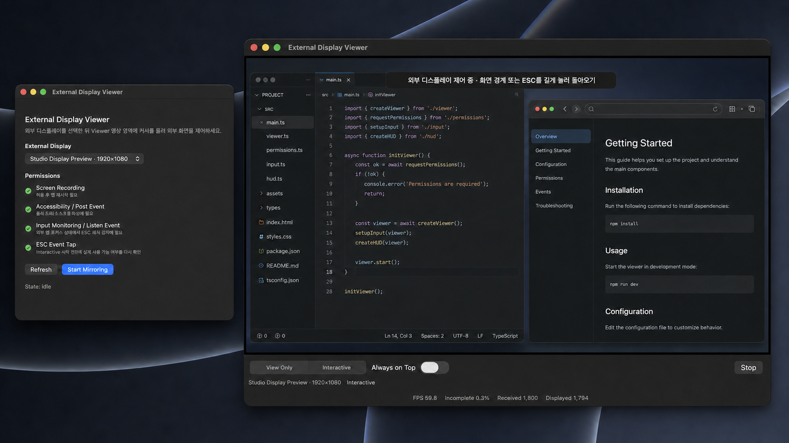

# External Display Viewer

확장 모드로 연결된 외부 모니터 화면을 MacBook의 Viewer 창에 미러링하는 프로그램입니다. 사용자가 커서를 외부 모니터까지 직접 옮길 필요 없이, Viewer 안에서 화면을 보며 클릭·드래그·스크롤할 수 있습니다.

## 왜 만들었나요?

회의실에서 발표용 외부 모니터가 좌우에 놓여 있으면 내용을 확인할 때마다 고개를 돌려야 해 목이 불편했습니다. “그냥 미러링 모드를 쓰면 되지 않을까?”라고 생각할 수 있지만, 내장 모니터에서는 개인 작업을 계속하면서 외부 모니터에는 공유할 내용만 띄워야 했습니다. 그래서 확장 모드는 유지하되, 외부 화면을 내장 모니터의 Viewer에서 바로 확인하고 조작할 수 있도록 만들었습니다.

## 제가 쓰는 방식

저는 Viewer를 내장 모니터에서 전체 화면으로 열어 별도의 작업 화면처럼 사용합니다. 트랙패드로 좌우로 쓸어 개발 화면과 Viewer를 빠르게 오가며, 고개를 돌리지 않고 외부 모니터에 공유 중인 내용을 확인하고 조작합니다.

## 실행 예시



왼쪽에서 외부 디스플레이와 권한을 확인한 뒤 `Start Mirroring`을 누르면, 오른쪽 Viewer에서 외부 화면을 보며 `View Only` 또는 `Interactive`로 사용할 수 있습니다. Interactive에서는 포인터·클릭·드래그·스크롤을 전달하고, 화면 경계 또는 ESC 길게 누르기로 Viewer에 돌아옵니다.

> 이 이미지는 앱 자체의 DEBUG Visual QA 프리뷰를 실행해 캡처한 UI를 바탕으로 사용 흐름을 한 장에 합성한 예시입니다. Viewer 안의 코드 편집기와 문서 화면은 앱 기능이 아니라 미러링되는 외부 디스플레이 콘텐츠를 나타냅니다. 현재 캡처 환경에는 외부 디스플레이가 연결되어 있지 않아 실제 하드웨어 화면은 아닙니다.

## 요구 환경

- macOS 15.0 이상
- MacBook 내장 디스플레이 + 외부 모니터 1대 이상
- macOS 디스플레이 설정: 미러링이 아닌 확장 모드
- 비샌드박스 로컬 실행 앱

## 빌드와 실행

```zsh
swift test
swift build -c release
zsh Scripts/build-app.sh
open build/ExternalDisplayViewer.app
```

`Scripts/build-app.sh`는 릴리즈 실행 파일을 빌드하고, iCloud/File Provider 메타데이터의 코드서명 오염을 피하기 위해 실제 앱을 `~/Library/Application Support/ExternalDisplayViewer/ExternalDisplayViewer.app`에 배치한 뒤 `build/ExternalDisplayViewer.app` 링크를 만듭니다. 앱은 키체인의 첫 번째 유효한 `Apple Development` 인증서로 안정적인 코드 서명과 서명 검증을 수행합니다. 다른 인증서를 사용하려면 `EXTERNAL_DISPLAY_VIEWER_CODESIGN_IDENTITY="인증서 이름" zsh Scripts/build-app.sh`로 지정합니다. 안정적인 인증서가 없으면 빌드는 실패하며, 권한 신원이 매 빌드마다 바뀌는 ad-hoc 서명으로 자동 폴백하지 않습니다.

## 필요한 macOS 권한

앱 기능은 macOS 개인정보 보호 권한에 의해 분리됩니다.

- 화면 기록(Screen Recording): 외부 디스플레이를 Viewer에 표시하기 위해 필요합니다. 없으면 Start가 비활성화됩니다.
- 손쉬운 사용(Accessibility): 실제 마우스 포인터를 외부 디스플레이 좌표로 이동하고 클릭/드래그/스크롤 이벤트를 게시하기 위해 필요합니다.
- 입력 모니터링(Input Monitoring): ESC 길게 누르기와 짧은 ESC 판단을 위해 필요합니다.

화면 기록 권한을 새로 허용하거나 위 권한을 변경한 뒤에는 앱을 완전히 종료하고 다시 실행해야 macOS TCC 상태가 안정적으로 반영됩니다.

이전 ad-hoc 서명 빌드에서 새 안정 서명 빌드로 처음 바꿀 때는 macOS가 다른 코드 신원으로 인식합니다. 시스템 설정의 **개인정보 보호 및 보안 > 화면 및 시스템 오디오 녹음**에서 기존 ExternalDisplayViewer 권한을 한 번 껐다가 새 앱의 `Request`로 다시 허용한 뒤 앱을 완전히 재실행하세요. 그 뒤에는 같은 인증서로 빌드되는 한 재빌드해도 권한 신원이 유지됩니다.

## 사용 방식

1. 앱을 실행합니다.
2. 목록에서 내장 디스플레이가 아닌 외부 디스플레이를 선택합니다.
3. Start를 누르면 Viewer 창이 열리고 기본값은 View Only입니다.
4. Viewer의 실제 미러링 영상 영역에 커서를 올리면 Interactive로 전환되고, 실제 커서가 외부 디스플레이의 같은 정규화 위치로 이동합니다.

View Only는 미러링만 수행합니다. Interactive는 화면 기록, 손쉬운 사용, 입력 모니터링, 이벤트 탭 사용 가능 상태, 그리고 이 앱의 보이는 창이 소스 외부 디스플레이와 겹치지 않는 조건을 모두 만족할 때만 자동 진입합니다. 기존 클릭 기반 제어 전환은 보조 경로로 유지됩니다.

## 입력 매핑과 안전 규칙

- Viewer의 검은 레터박스, 하단 컨트롤, 진단 UI에서는 자동 전환하지 않습니다.
- 실제 영상 영역 진입점은 Viewer 안의 상대 위치를 선택한 외부 디스플레이의 CoreGraphics 전역 좌표로 매핑합니다.
- 외부 디스플레이의 상·하·좌·우 경계 밖으로 이동하려 하면 Viewer의 같은 경계 비율 위치로 복귀합니다. 복귀점은 영상 내부가 아니라 해당 방향의 레터박스, 하단 컨트롤 UI 또는 가장 가까운 비영상 영역입니다.
- 드래그 중 외부 화면 밖으로 움직이면 자동 복귀하지 않고 가장 가까운 소스 디스플레이 경계로 클램프합니다. 버튼을 놓은 뒤 다음 바깥 방향 이동에서 Viewer로 복귀합니다.
- 좌/우/중간 클릭, 더블 클릭, 양축 스크롤을 전달합니다.
- 일반 키보드 입력 합성은 범위 밖입니다. ESC만 전용 정책으로 처리합니다.

## ESC 복귀와 HUD

- hover 포털로 Interactive에 진입한 뒤 ESC를 0.8초 이상 길게 누르면 포털 진입 당시 Viewer에 있던 커서 위치로 복귀합니다. 보조 click fallback으로 진입한 경우에는 클릭 직전에 저장한 `returnPoint`로 복귀합니다.
- 복귀 시 활성 드래그가 있으면 안전 mouse-up을 먼저 시도하고, Viewer를 전면으로 올린 뒤 View Only로 돌아갑니다.
- 짧은 ESC는 원래 frontmost 앱/PID가 그대로 살아 있고 그대로 앞에 있을 때만 재전송합니다. frontmost 앱이 바뀌면 폐기합니다.
- 제어 전환 HUD는 `외부 디스플레이 제어 중 · 화면 경계 또는 ESC를 길게 눌러 돌아오기` 문구로 약 1.5초 표시됩니다.
- 복귀 HUD는 `Viewer로 돌아왔습니다` 문구로 약 1.2초 표시됩니다.
- HUD는 Viewer 캡처 영역 top-center에 뜨며 포인터 hit test를 받지 않습니다.

## 소스 디스플레이 겹침 방지

Interactive는 Viewer를 포함한 이 앱의 보이는 창이 선택한 외부 디스플레이와 겹치지 않을 때만 허용됩니다. 대상 앱(예: Chrome)은 외부 디스플레이에 그대로 표시할 수 있습니다. Viewer가 소스 외부 디스플레이에서 전체 화면으로 전환되면 즉시 전체 화면을 빠져나옵니다. 겹침이 있으면 `Interactive를 켜려면 Viewer 창을 소스 외부 디스플레이 밖으로 이동하세요.` 경고가 표시되고 Interactive가 비활성화됩니다.

## 성능과 FPS 표시

- 캡처 프레임은 최신 프레임 하나만 대기시키며, 매 프레임을 SwiftUI 상태로 발행하지 않고 Viewer의 CALayer에 직접 표시합니다.
- 프레임 갱신으로 인한 Viewer 레이아웃 재계산은 소스 해상도가 바뀔 때만 수행하므로 장시간 사용 중 불필요한 SwiftUI 재구성과 레이아웃 작업을 피합니다.
- 하단 FPS는 앱 시작 이후의 누적 평균이 아니라 최근 1초 동안 실제로 표시된 프레임의 이동값입니다. 따라서 현재 체감 성능 변화를 바로 반영합니다.

## 수동 하드웨어 QA 매트릭스

아래 항목은 실제 외부 모니터, macOS TCC 권한, Chrome 같은 대상 앱, 그리고 일부 항목은 240-FPS 촬영 장비가 필요한 수동 검증입니다. 현재 문서 작성 시점에는 자동 테스트/빌드 검증만 수행했고, 물리 하드웨어 및 240-FPS 측정은 pending입니다.

| Scenario | Setup and action | Expected observable result |
| --- | --- | --- |
| Launch and discovery | In System Settings, place the built-in display left of one external display in Extended mode. Run `open build/ExternalDisplayViewer.app`, grant Screen Recording, relaunch, select the non-built-in display, and start. | The external display appears once by name/resolution; Viewer opens on the built-in display in View Only and shows the full source with black letterboxing where needed. |
| Permission denial | Revoke each of Screen Recording, Accessibility, and Input Monitoring one at a time, relaunch, and refresh. | Missing Screen Recording disables Start; missing Accessibility or Input Monitoring still permits View Only but disables Interactive with the matching settings guidance. |
| Hover portal and click variants | Move the cursor from Viewer nonvideo UI into the actual mirrored video area near center and all four capture corners; then perform single left, right, middle, and double clicks on visible Chrome controls. | The real cursor lands on the corresponding external point without crossing into an adjacent display; Chrome observes the matching click/button/click count. Letterbox/control UI hover does not transfer. |
| Edge return, scroll and drag | Over a horizontally and vertically scrollable Chrome page, scroll on both axes; move out through all four external-display edges; drag a selectable item while moving beyond each external edge before release. | Scroll direction and both axes match; non-drag edge movement returns to Viewer at the same edge ratio in letterbox/footer/nearest nonvideo UI; drag remains active, clamps to the closest source edge, and does not auto-return until release plus the next outward move. |
| Source overlap guard | Move any visible window from this app so it intersects the selected external display, then try Interactive and full screen on that display. | Interactive is disabled with the move-off-source warning; source-display full screen exits immediately. Moving this app's visible windows away restores eligibility. |
| Control HUD | Enter the actual mirrored video area to start Interactive. | The top-center nonblocking HUD reads `외부 디스플레이 제어 중 · 화면 경계 또는 ESC를 길게 눌러 돌아오기`, accepts no hit tests, fades, and disappears after about 1.5 seconds. |
| Short ESC | Open a Chrome context menu, press and release ESC before 0.8 seconds without changing frontmost app. Repeat while switching frontmost apps before release. | First attempt closes the context menu once and leaves control external; second attempt is discarded and does not send ESC to either app. |
| Long ESC return | Record the cursor position in Viewer, transfer control, hold ESC for at least 0.8 seconds, and release. | Any active drag receives mouse-up; cursor returns within 2 points of the saved global position or current Viewer capture center; Viewer becomes frontmost and View Only; return HUD reads `Viewer로 돌아왔습니다` for about 1.2 seconds. |
| Cable removal | Start a Viewer-owned drag, then disconnect the selected external display before mouse-up. | A safe synthetic mouse-up is attempted once, cursor returns to Viewer, capture closes or shows a recoverable error, and no stuck-button behavior remains. |
| 60-second capture metrics | Keep the native-resolution source changing for 60 seconds and record the Viewer diagnostics footer at regular intervals and at the end. | The average of the sampled recent-one-second displayed FPS values is at least 30 while cumulative received/displayed counts continue increasing and incomplete/dropped ratio stays below 5%; record resolution, counts, FPS samples, and ratio in the QA evidence. |
| 240-FPS latency | Film the input finger/trackpad and the Viewer feedback in one 240-FPS camera frame for 20 clicks. For each click count frames from physical contact to the first changed Viewer pixel and compute `frames / 240 × 1000 ms`. | Median of 20 measurements is at most 100 ms and the nearest-rank p95 is at most 180 ms; retain the frame counts and computed values. |

## 검증 상태

- 자동 단위 테스트, 릴리즈 빌드, 앱 번들 생성, plist lint, 안정적인 Apple Development codesign 검증은 로컬에서 실행 가능합니다.
- 실제 외부 디스플레이 상호작용과 60초/240-FPS 성능 측정은 대상 하드웨어에서 별도로 수행해야 합니다.
